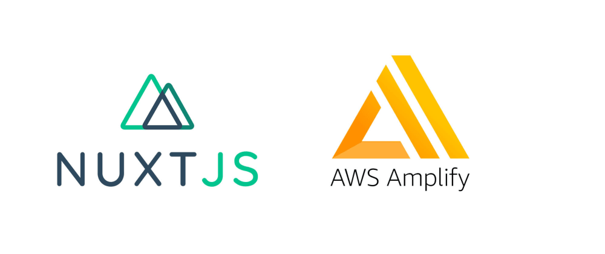

# Nuxt with AWS Authentication starter pack


## Description
This is a [Nuxt JS](https://nuxtjs.org/) app template with [Amazon Cognito](https://aws.amazon.com/cognito/) Authentication (JWT Token).  
It provides a complete Auth workflow (Sign In, Sign Up, Reset or Change Password) and route protection (with Nuxt Middleware).   
It uses [AWS Amplify](https://docs.amplify.aws/) library for all authentication actions.

## Installation
```bash
# clone or download the project
$ git clone https://github.com/fatb38/nuxt-aws-auth-starter-pack.git

# install dependencies
$ npm install

# serve with hot reload at localhost:3000
$ npm run dev
```

## Getting Started
App authentication required AWS credentials. They are set into environment variables in the [`nuxt.config.js`](./nuxt.config.js) file :

```javascript
env: {
  REGION: process.env.REGION,
  IDENTITY_POOL_ID: process.env.IDENTITY_POOL_ID,
  USER_POOL_ID: process.env.USER_POOL_ID,
  USER_POOL_WEB_CLIENT_ID: process.env.USER_POOL_WEB_CLIENT_ID,
  ACCESS_KEY_ID: process.env.ACCESS_KEY_ID,
  SECRET_ACCESS_KEY: process.env.SECRET_ACCESS_KEY
}
```
Create a local `.env` file into the root folder and simply add your secrets.
```dotenv
REGION="eu-west-1"
IDENTITY_POOL_ID="eu-west-1:xxxxxxxx-xxxx-xxxx-xxxx-xxxxxxxxxxxx"
USER_POOL_ID="eu-west-xxxxxxxxxxx"
USER_POOL_WEB_CLIENT_ID="xxxxxxxxxxxxxxxxxxxxxxxxxx"
ACCESS_KEY_ID="XXXXXXXXXXXXXXXXXXXX"
SECRET_ACCESS_KEY="xxxxxxxxxxxxxxxxxxxxxxxxxxxxxxxxxxxxxxxx"
```
Now you can test : just sign in with your AWS username / password !!

## Usage

### Amplify authentication methods
All auth methods are available in Vue store actions into [`auth.ts`](./store/auth.js).  
You can use it globally into the app with `$store.dispatch` or `mapActions` (see [Vuex guide](https://vuex.vuejs.org/fr/guide/actions.html) for store usage).  
All methods are asynchronous and return the Amplify response object.

Here is the login example :
```javascript
// into store auth.ts
async login ({ commit }, { username, password }) {
  const user = await Auth.signIn(username, password)
  commit('set', user)
  return user
}

// usage into login.vue component
methods: {
...mapActions('auth', ['login']),

    async performLogin () {
    this.pending = true
    try {
      await this.login(this.credentials)
      this.$router.push('/')
    } catch ({ message }) {
      console.error(message)
      this.pending = false
    }
  }
}
```

After a successful login, all user information are saved into auth store object `user` and JWT tokens into the local storage, thanks to Amplify.


### AuthService Class
The app comes with a custom [`auth.ts`](./plugins/auth.ts) plugin that builds a `AuthService Class` available with global `$auth` variable.  
It's useful to add some getters to the user object (for example to check if authenticated or to get email etc...) rather than getting through the store state.    
By default, it provides authentication state, user, email and profil picture, but let free to add your own getters !

### Tokens into requests
Axios is already set up to add the JWT token on each request and automatically refreshes it if needed.  
The configuration is in the plugin folder into [`axios.js`](./plugins/axios.js) file


### Public and Protected Routes
You can protect one or more routes, or the whole app if you need, thanks to the middleware [`authenticated.js`](./middleware/authenticated.js).  
A Nuxt middleware is a function executed before rendering a page. You can easily redirect user if not authenticated.  
In this template, all routes are protected, the user is simply redirected towards login page if not authenticated. You also can add some public routes, see the comment below.

Here's the plugin code :
```javascript
export default function ({ store, redirect, route }) {
  // If you want to let some public routes
  if (route.name === 'routeName') {
    return
  }
  if (!store.state.auth.isAuthenticated && route.name === 'login') {
    return
  }
  if (!store.state.auth.isAuthenticated) {
    return redirect('/login')
  }
}
```
